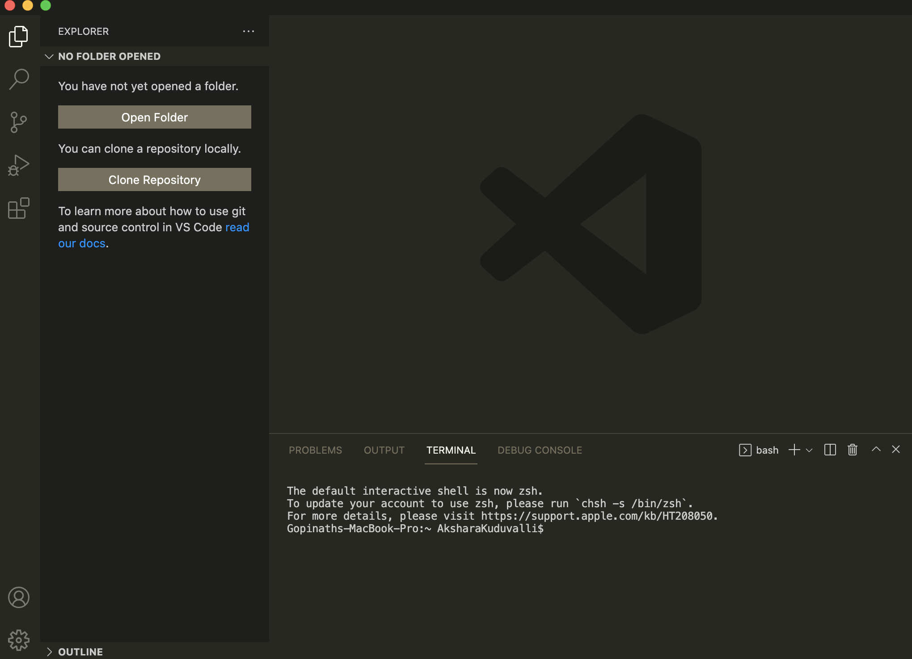
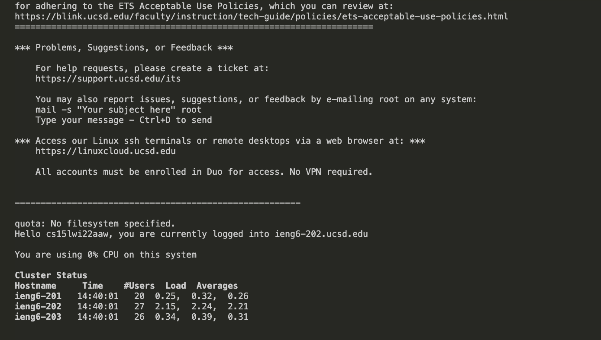
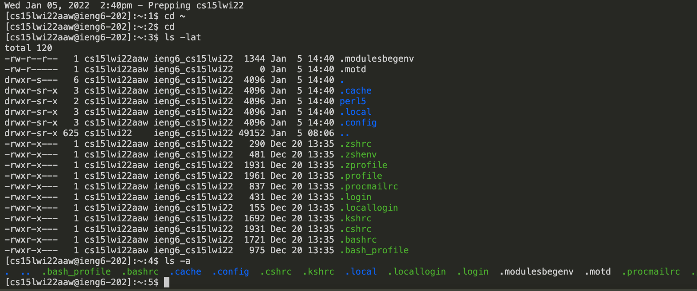
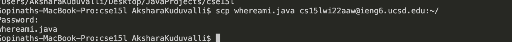
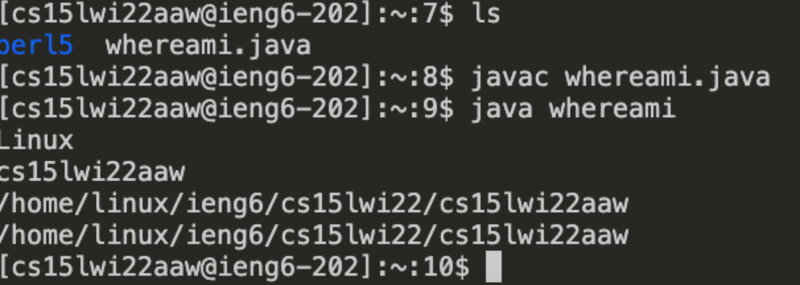
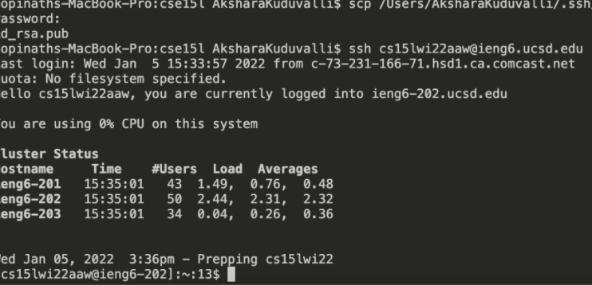
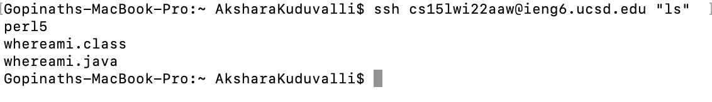

# Lab Report Week 2: Logging into an account on `ieng6`

## Installing VSCode 


* VSCode is a code editor that will make your life easier. Install VScode [here](https://code.visualstudio.com/). 
* Once you download VSCode, open VSCode. The open page should look something like the image above. 

---

## Remotely connecting to the server
* Open a new terminal window in VSCode. Since I am on a mac, I dont have to download ssh, but windows users can over [here](https://docs.microsoft.com/en-us/windows-server/administration/openssh/openssh_install_firstuse).
* To find your account for whichever course, search your username [here](https://sdacs.ucsd.edu/~icc/index.php). You may have to change your password to activate the account; I know I did. It might take a while to get activated. 
* After activating your account for a given course, enter **ssh [your account]** to connect to the ieng6 server remotely. 
```
$ ssh cse15lwi22aaw@ieng6.ucsd.edu
```
* follow the prompts (answer yes) and then you will be promted to enter in you password. It is your ucsd login password. 
* You output should be similar to this image--if so, you have connected to the server!




---

## Trying a few commands 
* Here are a few commands that I tried once I logged into the server. 
```
cd ~
cd 
ls -a
ls -lat
```



* based on the output, I've concluded that `cd ~` and `cd ` will return to the root directory (which I was already in in the following screenshot), `ls -lat` will display all the folders abd files with timestamps and extra information of the current directory, and `ls -a` displays all directories that begin with a **.** or a **..**. 

---

## Moving Files With `scp`
* you can work on files remotely from the client side then copy them onto a server. Once way to do this is through the `scp` command. The way that you write the command is `scp [filename] [username]:~/` 
* For example, when I save the file *whereami.java* to the server, I run the following command:



* I am prompted for my password, but then the file is saved on the server!
* the program `whereami.java` prints the a few properties: the **os** that the program runs on, the **name** of the user, the **home** of the user, and the current **directory**. 
* We can visibly see the difference between running the program on the client side vs. server side. 

client side:

```
Mac OS X
AksharaKuduvalli
/Users/AksharaKuduvalli
/Users/AksharaKuduvalli/Desktop/JavaProjects/cse15l

```

server side: 


---

## Setting an ssh key
* when you create an ssh key, a public and private key are created. if we copy the public key onto the server, then we are able to log on to the server without needing to enter in a password
* First: run the command `$ ssh-keygen`, then save the the keys in whichever folder you want. Then, run the following command (with your own info) to save the public key onto the sever:

```
$ scp /Desktop/javaprojects/.ssh/id_rsa.pub cs15lwi22aaw@ieng6.ucsd.edu:~/.ssh/authorized_keys

```

Now you can log in without your password like this: 




---

## Optimizing Remote Running 



* Now that we can log into the server without having to enter our password, we can explore even more shortcuts! For Example, the one above is a way to run commands without having to log in the the server first and then run a separate command. 

* Another way to optimize our remote running is through the **up arrow** keystroke, which will automatically enter in your previous command (or more previous, depending on how many times you press the up arrow), so that you don't have to type out the whole command over again. 

* Also, adding a semicolon to the end of your command allows you to enter multiple commands in one line to save time—for example, if I wanted to run and compile a program named MyProg.java, I could do that in one line like this:

```
$ javac MyProg.java; java MyProg

```

* Furthermore, using our up arrow shortcut, if I wanted to run the above commands multiple times, if I used the up arrow instead of typing it out, My keystrokes number would be reduced from **30** to **just 1**. 


