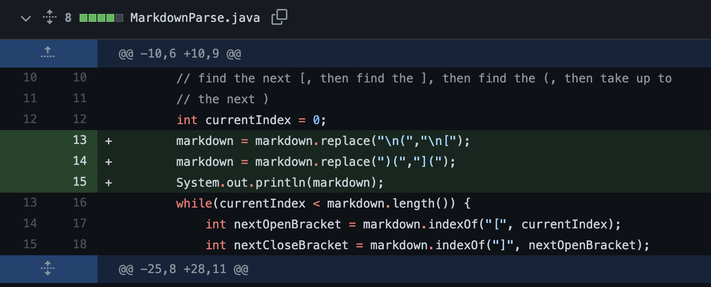

# Lab Report Week 4: Debugging

## Error 1: Links using only parentheses

* The test file that prompted me to make this change was [this file](testcase1.md) where the label for the link also used parentheses instead of open and close brackets. 

* the output without fixing the mistake looks like this (when it fails):

* As shown above, without fixing the error, the original program would result in an infinite loop. This is the *symptom* of the failure inducing input, but it is not the source of the issue. 