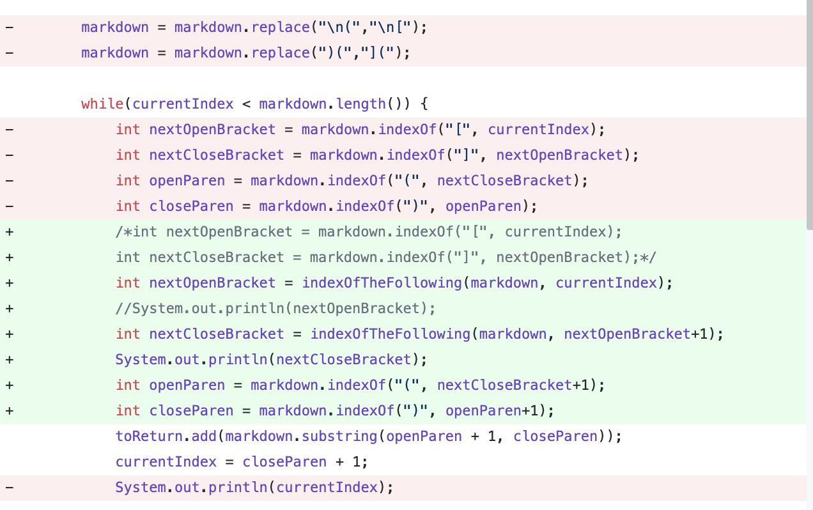
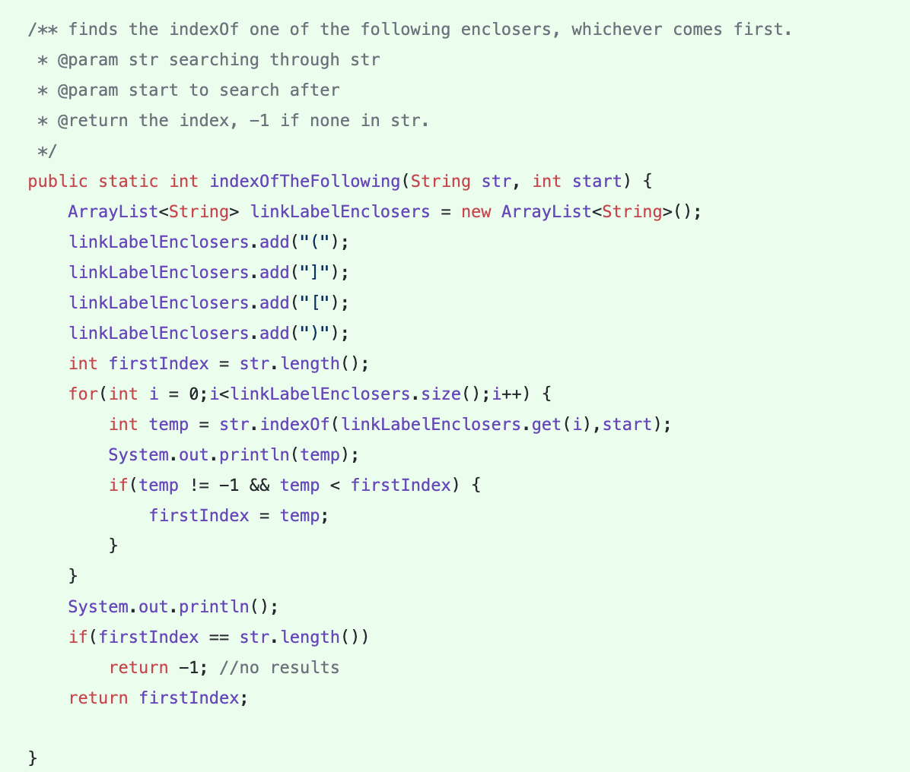
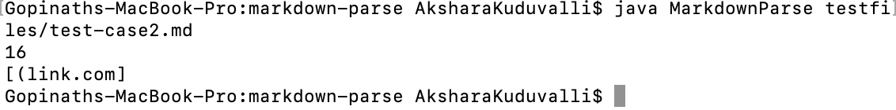

# Lab Report Week 4: Debugging

## Error 1: Links using only parentheses


* The test file that prompted me to make this change was [this file](testcase1.md) where the label for the link also used parentheses instead of open and close brackets. 

* the output without fixing the mistake looks like this (when it fails):

* As shown above, without fixing the error, the original program would result in an infinite loop. This is the *symptom* of the failure inducing input, but it is not the source of the issue. 

* The **bug** is that the original program immediately looks for an open and close bracket, because it expects that the format of every link will be like `[file label](link.com)` which, as shown by the failure inducing input, is not always the case. The symptom, the infinite loop, is a result of the fact that in this part of the while loop, 
```java
int nextOpenBracket = markdown.indexOf("[", currentIndex);
int nextCloseBracket = markdown.indexOf("]", nextOpenBracket);
```
* the values of `nextOpenBracket` and `nextCloseBracket` will both be -1, and current index will not increment properly as a result, causing an infinite loop. This is the **bug**. 

* In my solution for this error, 
```java
markdown = markdown.replace("\n(","\n[");
markdown = markdown.replace(")(","](");
```
* I replaced the open parentheses at the beginning with a bracket, and close parentheses at the end with a close bracket, to ensure that the rest of the program runs successfully. 


## Error 2: Links where I used parentheses again, except now I switch the open and close parentheses


* The test file that prompted me to make this change was [this file](testcase2.md) where I switched the parentheses such that the open parentheses encloses the end of the link name, and the close parentheses encolses the beginning. 

* the output without fixing the mistake looks like this (when it fails):

* As shown above, without fixing the error, even though the program compliles and runs without any exceptions, it treats the open parentheses of the link as being part of the link text (the *symptom* of the failure inducing input), so we can still consider this a bug, even though on the surface it might seem like the program works. But just because a program compiles and runs doesn't mean it is not error-prone, which is why extensive testing is important. 

* The **bug** is that the program immediately assumes that the link label will be enclosed by an opener, then a closer, whether that be parentheses or brackets. Given that people will always find a way to create more problems, it does not account for the fact that the link label could be enclosed by the opposite bracket or parentheses, respectively. The symptom, the extra parentheses in the link, is caused by the fact that in the following lines: 

```java
markdown = markdown.replace(")(","](");
```

```

```java
int nextOpenBracket = markdown.indexOf("[", currentIndex);
int nextCloseBracket = markdown.indexOf("]", nextOpenBracket);
```
* the values of `nextOpenBracket` will be at the `(` that was used to enclose the link *label* and not the actual link, hence the program treats the *actual* enclosing open parentheses as being a part of the link text. This is the **bug**. 

* In my solution for this error, I added the following method: 

```java
public static int indexOfTheFollowing(String str, int start) {
        ArrayList<String> linkLabelEnclosers = new ArrayList<String>();
        linkLabelEnclosers.add("(");
        linkLabelEnclosers.add("]");
        linkLabelEnclosers.add("[");
        linkLabelEnclosers.add(")");
        int firstIndex = str.length();
        for(int i = 0;i<linkLabelEnclosers.size();i++) {
            int temp = str.indexOf(linkLabelEnclosers.get(i),start);
            if(temp != -1 && temp < firstIndex) {
                firstIndex = temp;
            }
        }
        System.out.println();
        if(firstIndex == str.length())
            return -1; //no results
        return firstIndex;

    }
```

* This method searches for any of the following `( ) [ ]` as either the open or closing encloser for the link label so that even if you switch the parentheses, the program still works. I also removed the change I made earlier because it is no longer needed. 
* Furthermore, I changed the starting index (+1) that the indexOf searches for so that it would not be stuck on the same index over and over, since now any of the `linkLabelEnclosers` contents could be considered for the open and close. Now the program runs successfully. 
